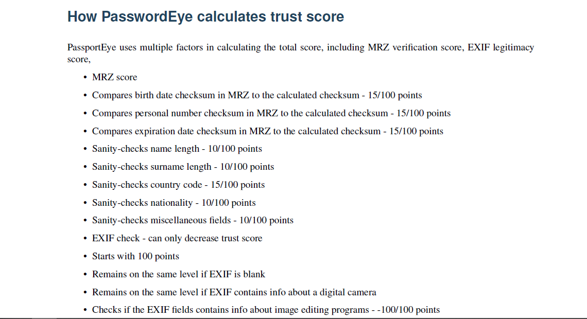

# ID_Card_Detector

### Extracting text from Passport or ID Card

- Passport Eye library for extracting the text.
- the picture above shows which elements it checks to validate the Passport
- Limitation of this code is that I did not pay attention to how doc is scanned assuming it is correctly done.
- I wanted to train a model using TesseractOCR and others.

### Extracting Photo from Passport or ID Card

- OpenCV library for extracting the Photo.
- if there are several photos in a passport or ID it will take the first one.
- Limitation of this code is that I did not spend time on preprocessing the doc to get better photo.

### It was an interesting task to spend time on. I really enjoyed doing it.
